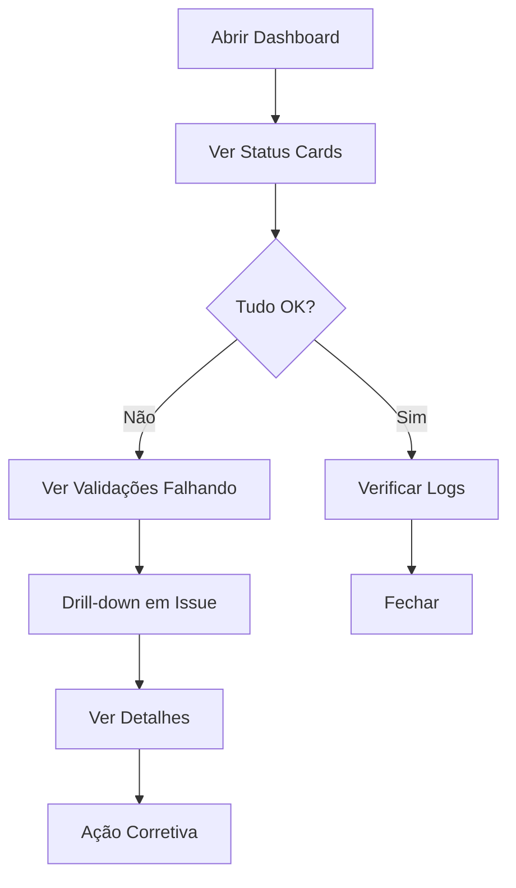
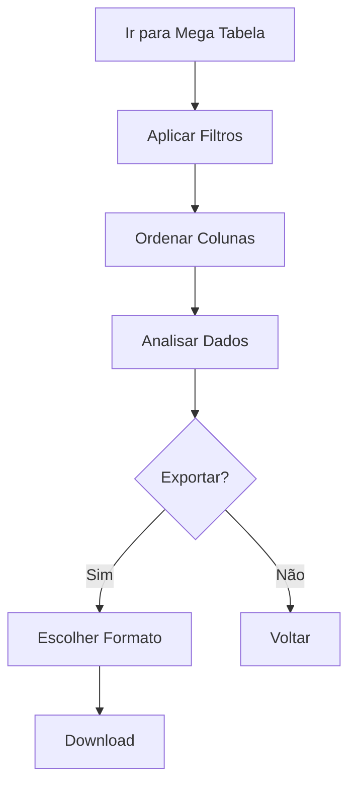
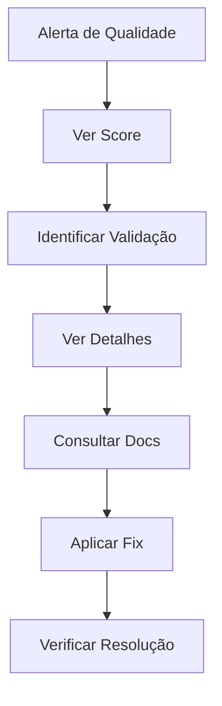

# Mapa de Navegação - TechDengue Dashboard

**Data:** 31/10/2025  
**Versão:** React Migration v1.0  
**Objetivo:** Definir estrutura de navegação, fluxos e estados

---

## 🗺️ Arquitetura de Informação

### Hierarquia de Páginas

```
TechDengue Dashboard
│
├─ 🏠 Home / Monitor de Qualidade (/)
│  ├─ Status Cards (5)
│  ├─ Quality Gauge
│  ├─ Layers Chart
│  ├─ Validations Table
│  └─ Activity Log
│
├─ 📊 Qualidade de Dados (/quality)
│  ├─ Score Overview
│  ├─ Validations Detail
│  ├─ Issues List
│  └─ Recommendations
│
├─ 📋 Mega Tabela (/data-table)
│  ├─ Filters Panel
│  ├─ Data Grid (virtualized)
│  ├─ Export Options
│  └─ Column Config
│
├─ ⚙️ Configurações (/settings)
│  ├─ Preferences
│  ├─ Notifications
│  └─ API Keys
│
└─ 📚 Documentação (/docs)
   ├─ Getting Started
   ├─ API Reference
   └─ Changelog
```

---

## 🧭 Navegação Principal

### App Shell Components

```tsx
<AppShell>
  <Header>
    <Logo />
    <Breadcrumbs />
    <CommandPalette trigger="Ctrl+K" />
    <UserMenu />
    <ThemeToggle />
  </Header>
  
  <Sidebar collapsed={mobile}>
    <NavLinks />
    <QuickActions />
    <StatusIndicator />
  </Sidebar>
  
  <Content>
    <Outlet /> {/* React Router */}
  </Content>
  
  <Footer>
    <Version />
    <Links />
  </Footer>
</AppShell>
```

### Sidebar Navigation

| Ícone | Label | Route | Badge | Shortcut |
|-------|-------|-------|-------|----------|
| 🏠 | Monitor | `/` | Live | `Ctrl+H` |
| 📊 | Qualidade | `/quality` | Score | `Ctrl+Q` |
| 📋 | Dados | `/data-table` | Count | `Ctrl+D` |
| ⚙️ | Config | `/settings` | - | `Ctrl+,` |
| 📚 | Docs | `/docs` | - | `Ctrl+?` |

---

## 🎯 Fluxos Principais

### Fluxo 1: Monitoramento Diário



**Páginas:** Home → Quality (se problema)  
**Tempo Esperado:** 2-5 min  
**KPI:** % de issues resolvidos < 24h

### Fluxo 2: Análise de Dados



**Páginas:** Data Table  
**Tempo Esperado:** 5-15 min  
**KPI:** % de exports bem-sucedidos

### Fluxo 3: Investigação de Problema



**Páginas:** Home → Quality → Docs  
**Tempo Esperado:** 10-30 min  
**KPI:** MTTR (Mean Time To Resolution)

---

## 🔀 Estados de Navegação

### Estados Globais

| Estado | Descrição | Visual | Ação |
|--------|-----------|--------|------|
| **Authenticated** | Usuário logado | Avatar no header | Logout |
| **Unauthenticated** | Sem login | Login button | Redirecionar /login |
| **Loading** | Carregando dados | Skeleton | Aguardar |
| **Error** | Erro de rede | Error boundary | Retry |
| **Offline** | Sem conexão | Banner offline | Reconectar |

### Estados por Página

#### Home / Monitor

| Estado | Condição | Visual | Ação |
|--------|----------|--------|------|
| **Healthy** | Score > 90% | Cards verdes | Nenhuma |
| **Warning** | Score 70-90% | Cards amarelos | Investigar |
| **Critical** | Score < 70% | Cards vermelhos | Ação urgente |
| **No Data** | Sem dados | Empty state | Configurar |
| **Stale** | Dados antigos (>24h) | Banner warning | Atualizar |

#### Quality

| Estado | Condição | Visual | Ação |
|--------|----------|--------|------|
| **All Pass** | 100% validações OK | Badge verde | Nenhuma |
| **Some Fail** | 1+ validações falham | Lista de issues | Corrigir |
| **Loading** | Carregando validações | Skeleton | Aguardar |
| **Error** | Erro ao carregar | Error alert | Retry |

#### Data Table

| Estado | Condição | Visual | Ação |
|--------|----------|--------|------|
| **Loaded** | Dados carregados | Tabela | Interagir |
| **Filtered** | Filtros ativos | Badge count | Limpar |
| **Empty** | Sem resultados | Empty state | Ajustar filtros |
| **Loading** | Carregando | Skeleton rows | Aguardar |
| **Error** | Erro | Error alert | Retry |

---

## 🎨 Empty States

### Home - Sem Dados

```tsx
<EmptyState
  icon={<Database />}
  title="Nenhum dado disponível"
  description="Configure a conexão com o banco de dados para começar."
  action={{
    label: "Configurar Banco",
    href: "/settings",
    variant: "primary"
  }}
/>
```

### Quality - Todas Validações Passando

```tsx
<EmptyState
  icon={<CheckCircle />}
  title="Tudo certo! 🎉"
  description="Todas as validações passaram com sucesso."
  variant="success"
/>
```

### Data Table - Sem Resultados

```tsx
<EmptyState
  icon={<Search />}
  title="Nenhum resultado encontrado"
  description="Tente ajustar os filtros ou limpar a busca."
  action={{
    label: "Limpar Filtros",
    onClick: clearFilters,
    variant: "secondary"
  }}
/>
```

---

## ⌨️ Command Palette

### Atalhos Globais

| Comando | Atalho | Ação |
|---------|--------|------|
| **Abrir Command Palette** | `Ctrl+K` / `Cmd+K` | Abrir busca |
| **Ir para Home** | `Ctrl+H` | Navegar / |
| **Ir para Quality** | `Ctrl+Q` | Navegar /quality |
| **Ir para Data** | `Ctrl+D` | Navegar /data-table |
| **Configurações** | `Ctrl+,` | Navegar /settings |
| **Ajuda** | `Ctrl+?` | Navegar /docs |
| **Toggle Theme** | `Ctrl+Shift+T` | Dark/Light |
| **Buscar** | `Ctrl+F` | Focus search |

### Comandos Contextuais

**Na página Home:**
- `r` - Refresh data
- `e` - Export report
- `f` - Toggle filters

**Na página Data Table:**
- `e` - Export CSV
- `x` - Export Excel
- `j` - Export JSON
- `c` - Configure columns
- `/` - Focus search

---

## 🔗 Breadcrumbs

### Estrutura

```tsx
<Breadcrumbs>
  <BreadcrumbItem href="/">Home</BreadcrumbItem>
  <BreadcrumbItem href="/quality">Qualidade</BreadcrumbItem>
  <BreadcrumbItem current>Validação #123</BreadcrumbItem>
</Breadcrumbs>
```

### Exemplos por Rota

| Rota | Breadcrumb |
|------|------------|
| `/` | Home |
| `/quality` | Home > Qualidade |
| `/quality/validation/123` | Home > Qualidade > Validação #123 |
| `/data-table` | Home > Dados |
| `/settings` | Home > Configurações |
| `/settings/notifications` | Home > Configurações > Notificações |

---

## 🚦 Permissões e Acesso

### Níveis de Acesso

| Nível | Páginas | Ações |
|-------|---------|-------|
| **Viewer** | Home, Quality, Data (read-only) | Ver dados |
| **Analyst** | + Export | Ver + Exportar |
| **Admin** | + Settings | Ver + Exportar + Configurar |

### Guards de Rota

```tsx
<Route path="/settings" element={
  <RequireAuth role="admin">
    <Settings />
  </RequireAuth>
} />
```

---

## 📱 Navegação Mobile

### Adaptações

| Desktop | Mobile | Mudança |
|---------|--------|---------|
| Sidebar sempre visível | Drawer (hamburguer) | Collapse |
| Breadcrumbs completos | Apenas página atual | Simplificar |
| Command Palette | Bottom sheet | Reposicionar |
| Tabela completa | Scroll horizontal | Virtualizar |

### Bottom Navigation (Mobile)

```tsx
<BottomNav>
  <NavItem icon={<Home />} label="Home" href="/" />
  <NavItem icon={<BarChart />} label="Quality" href="/quality" />
  <NavItem icon={<Table />} label="Dados" href="/data-table" />
  <NavItem icon={<Settings />} label="Config" href="/settings" />
</BottomNav>
```

---

## 🔄 Transições de Página

### Animações

```tsx
// Framer Motion
<AnimatePresence mode="wait">
  <motion.div
    key={location.pathname}
    initial={{ opacity: 0, y: 20 }}
    animate={{ opacity: 1, y: 0 }}
    exit={{ opacity: 0, y: -20 }}
    transition={{ duration: 0.2 }}
  >
    <Outlet />
  </motion.div>
</AnimatePresence>
```

**Duração:** 200ms (rápido, não distrair)  
**Easing:** ease-out  
**Respeitando:** `prefers-reduced-motion`

---

## 📊 Telemetria de Navegação

### Eventos Rastreados

```typescript
// Page view
trackEvent('page_view', {
  page: '/quality',
  referrer: '/',
  timestamp: Date.now()
});

// Navigation
trackEvent('navigation', {
  from: '/',
  to: '/quality',
  method: 'sidebar' | 'breadcrumb' | 'command-palette'
});

// Command Palette
trackEvent('command_palette', {
  action: 'open' | 'search' | 'execute',
  query: 'go to quality',
  result: '/quality'
});
```

---

## 🎯 Métricas de Sucesso

| Métrica | Target | Medição |
|---------|--------|---------|
| **Time to First Interaction** | < 3s | LCP |
| **Navigation Success Rate** | > 95% | Analytics |
| **Command Palette Usage** | > 30% | Event tracking |
| **Mobile Navigation Ease** | > 4/5 | User survey |
| **Error Rate** | < 1% | Error boundary |

---

## 📝 Próximos Passos

1. ✅ Implementar App Shell (Header, Sidebar, Content)
2. ✅ Configurar React Router com rotas
3. ✅ Criar Command Palette component
4. ✅ Implementar Breadcrumbs
5. ✅ Adicionar telemetria de navegação
6. ✅ Testes E2E de navegação (Playwright)

---

**Próximo Documento:** `functional-requirements.md`
